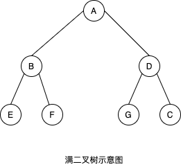
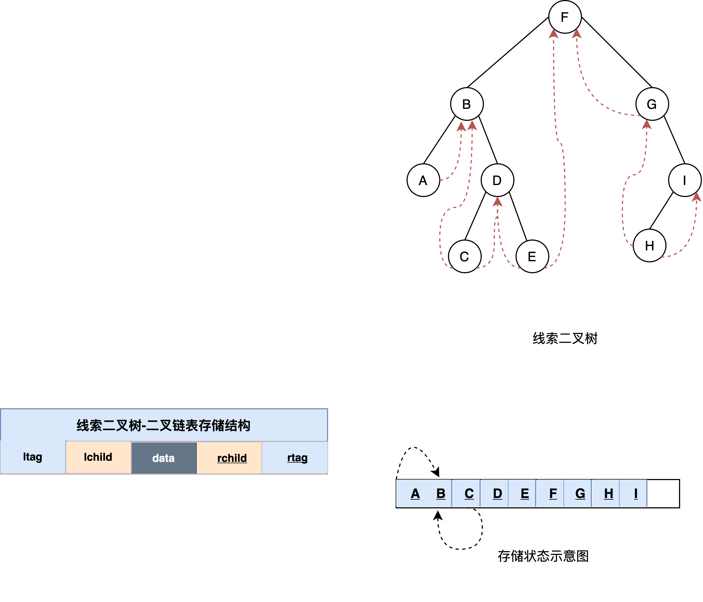
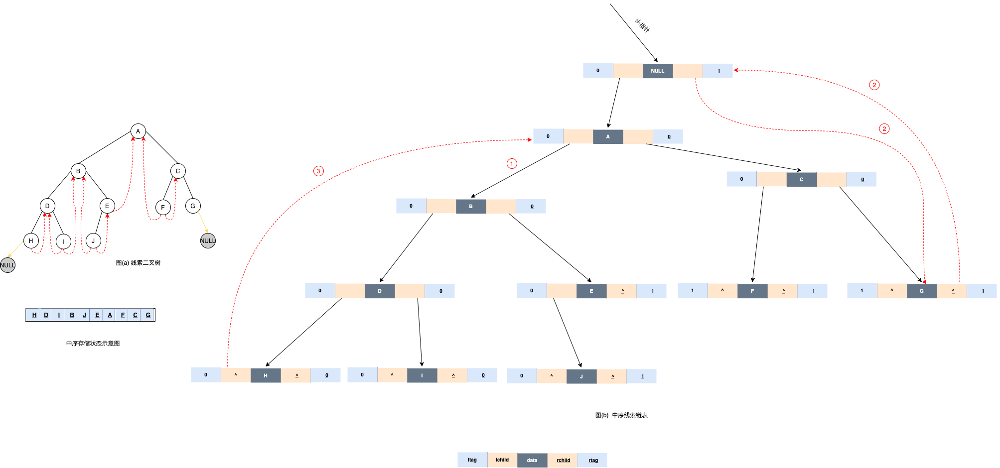
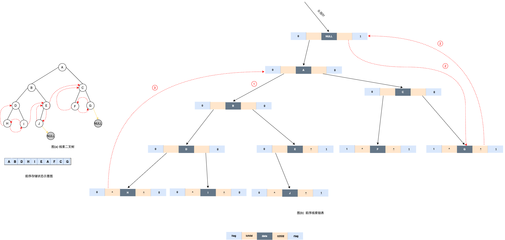

# 4.1.4.1 线索二叉树

通过前面对二叉树的学习，了解到二叉树本身是一种非线性结构，采用任何一种遍历二叉树的方法，都可以得到树中所有结点的一个线性序列。在这个序列中，除第一个结点外，每个结点都有自己的<font color=#008000>直接前趋</font>；除最后一个结点外，每个结点都有一个<font color=#008000>直接后继</font>。



例如，图 1 采用先序遍历的方法得到的结点序列为：` 1 2 4 5 3 6 7 `，在这个序列中，结点 2 的直接前趋结点为 1，直接后继结点为 4。


## 线索二叉树的定义


二叉树的遍历实质上是<font color=#008000>对一个非线性结构进行线性化的过程</font> ，它使得每个结点（除第一个和最后一个)在这些线性序列中<font color=#008000>有且只有一个直接前驱和直接后继。</font>

但是在二叉链表存储结构中，只能找到一个结点的左、右孩子，不能直接得到结点在任一遍历序列中的前驱和后继，这些信息只有在遍历的动态过程中才能得到，因此引入线索二叉树来保存这些动态过程中得到的信息。


###  线索二叉树的优缺点

**优点**

如果算法中多次涉及到对二叉树的遍历，**普通的二叉树就需要使用栈结构做重复性的操作**。

线索二叉树**不需要如此，在遍历的同时，使用二叉树中空闲的内存空间记录某些结点的前趋和后继元素的位置（不是全部）**。这样在算法后期需要遍历二叉树（深度优先遍历）时，就可以利用保存的结点信息，提高了遍历的效率。使用这种方法构建的二叉树，即为“<font color=red>线索二叉树</font>”。

**缺点**

如果在二叉树中想保存每个结点前趋和后继所在的位置信息，最直接的想法就是改变结点的结构，即添加两个指针域，分别指向该结点的前趋和后继。

但是这种方式会降低树存储结构的存储密度。而对于二叉树来讲，其本身还有很多未利用的空间。

### 线索二叉树的结点结构


<table><tr><td bgcolor=PowderBlue>
<font color=#008000>存储密度</font>指的是数据本身所占的存储空间和整个结点结构所占的存储量之比。
</td></tr></table>

每一棵二叉树上，很多结点都含有未使用的指向NULL的指针域。除了度为2的结点，度为 1 的结点，有一个空的指针域；叶子结点两个指针域都为NULL。

<table><tr><td bgcolor=PowderBlue>
规律：在有 n 个结点的二叉链表中必定存在 n+1 个空指针域。
</td></tr></table>

<font color=red>线索二叉树实际上就是使用这些空指针域来存储结点之间前趋和后继关系的一种特殊的二叉树。</font>

线索二叉树中，如果结点有左子树，则 lchild 指针域指向左孩子，否则 lchild 指针域指向该结点的直接前趋；同样，如果结点有右子树，则 rchild 指针域指向右孩子，否则 rchild 指针域指向该结点的直接后继。


## 建立线索二叉树

为了保存结点在任一序列中的前驱和后继信息，可以考虑在每个结点中增加两个指针域来存放遍历时得到的前驱和后继信息，这样就可以为以后的访问带来方便。但增加指针信息会降低存储空间的利用率，因此可以考虑采用其他方法


若 n 个结点的二叉树采用二叉链表做存储结构，则链表中必然有 n+1 个空指针域，可以利用这些空指针域来存放前驱和后继信息，为此需要在结点中增加标示 `ltag` 和 `rtag` 以区分孩子指针的指向，如下所示

线索二叉树中，如果结点有左子树，则 lchild 指针域指向左孩子，否则 lchild 指针域指向该结点的直接前趋；同样，如果结点有右子树，则 rchild 指针域指向右孩子，否则 rchild 指针域指向该结点的直接后继。


其中:

- LTag 和 RTag 为标志域。实际上就是两个布尔类型的变量：
- LTag 值为 0 时，表示 lchild 指针域指向的是该结点的左孩子；为 1 时，表示指向的是该结点的直接前趋结点；
- RTag 值为 0 时，表示 rchild 指针域指向的是该结点的右孩子；为 1 时，表示指向的是该结点的直接后继结点。

$$
ltag =
\begin{cases}
1   lchild  is the domain indicates the left child of a node \\
0   lchild is the domain indicates a direct precursor to a node
\end{cases}


$$

rtag =
\begin{cases}
1   rchild 域指示结点的右孩子 \\
0   rchild 域指示结点的直接后继
\end{cases}

结点结构代码实现：

```c
#define TElemType int//宏定义，结点中数据域的类型
//枚举，Link为0，Thread为1
typedef enum PointerTag{
    Link,
    Thread
}PointerTag;
//结点结构构造
typedef struct BiThrNode{
    TElemType data;//数据域
    struct BiThrNode* lchild,*rchild;//左孩子，右孩子指针域
   
    PointerTag Ltag,Rtag;//标志域，枚举类型
}BiThrNode,*BiThrTree;
```

表示二叉树时，使用图 2 所示的结点结构构成的二叉链表，被称为<font color=#008000>线索链表</font> ；构建的二叉树称为<font color=#008000>线索二叉树</font> 。


<table><tr><td bgcolor=PowderBlue>
线索链表中的<font color=#008000>“线索”</font>，指的是链表中指向结点前趋和后继的指针。二叉树经过某种遍历方法转化为线索二叉树的过程称为<font color=#008000>线索化</font>。
</td></tr></table>

### 对二叉树进行线索化

将二叉树转化为线索二叉树，实质上是在遍历二叉树的过程中，将二叉链表中的空指针改为指向直接前趋或者直接后继的线索。

<font color=red> 线索化的过程即为在遍历的过程中修改空指针的过程。</font>

在遍历过程中，如果当前结点没有左孩子，需要将该结点的 lchild 指针指向遍历过程中的前一个结点，所以在遍历过程中，设置一个指针（名为 pre ），时刻指向当前访问结点的前一个结点。


代码实现（拿中序遍历为例）：

```c
//中序对二叉树进行线索化
void InThreading(BiThrTree p){
    //如果当前结点存在
    if (p) {
        InThreading(p->lchild);//递归当前结点的左子树，进行线索化
        //如果当前结点没有左孩子，左标志位设为1，左指针域指向上一结点 pre
        if (!p->lchild) {
            p->Ltag=Thread;
            p->lchild=pre;
        }
        //如果 pre 没有右孩子，右标志位设为 1，右指针域指向当前结点。
        if (!pre->rchild) {
            pre->Rtag=Thread;
            pre->rchild=p;
        }
        pre=p;//线索化完左子树后，让pre指针指向当前结点
        InThreading(p->rchild);//递归右子树进行线索化
    }
}
```

注意：

<table><tr><td bgcolor=PowderBlue>
中序对二叉树进行线索化的过程中，在两个递归函数中间的运行程序，和之前介绍的中序遍历二叉树的输出函数的作用是相同的。
</td></tr></table>

将中间函数移动到两个递归函数之前，就变成了前序对二叉树进行线索化的过程；后序线索化同样如此


## 访问线索二叉树

[视频地址](https://www.youtube.com/watch?v=FgQYfN7YXtY)


1. 若 p 所指向的结点有空指针域，则响应的标志域置为1 ；
1. 若 pre != NULL 且 pre 所指的结点 rtag 等于1，则令 pre -> rchild = p; 
1. 若 p 指向的结点的ltag = 1 , 则令 p -> lchild = pre;
1. 若 pre 指向刚刚访问过的结点，即令 pre = p;

<font color=#008000> 需要说明的是，用这种方法得到的线索二叉树，其线索并不完整。也就是说，部分结点的前驱和后继信息还不能从中直接得到 </font>

如何在线索二叉树中查找结点的前驱和后继呢？

### 中序遍历线索二叉树

左根右
<font color=#008000> 中序遍历: A B C D E F G H I </font>

如何在线索二叉树中查找结点的前驱和后继呢？

以中序线索二叉树为例，令 p指向树中的某个结点，查找p所指结点的后继结点的方法如下所述

1. 若 p -> rtag == 1 ,则 p->child 即指向其后继结点
1. 若 p -> rtag == 0 ,则 p 所指结点的中序后继必然是其右子树中进行 `中序遍历` 得到的第一结点，也就是说，从p所指结点的右子树的根结点出发，沿左孩子指针链向下查找，直到找到一个没有左孩子的结点为止，这个结点就是p所指结点的直接后继结点，也称为p的右子树中"最左下"的结点





图中是一个按照中序遍历建立的线索二叉树。其中，实线表示指针，指向的是左孩子或者右孩子。虚线表示线索，指向的是该结点的直接前趋或者直接后继。

 
使用线索二叉树时，会经常遇到一个问题，如图 3 中，结点 b 的直接后继直接通过指针域获得，为结点 * ；而由于结点 * 的度为 2 ，无法利用指针域指向后继结点，整个链表断掉了。

当在遍历过程，遇到这种问题是解决的办法就是：<font color=red>寻找先序、中序、后序遍历的规律，找到下一个结点。</font>

在先序遍历过程中，如果结点因为有右孩子导致无法找到其后继结点，如果结点有左孩子，则后继结点是其左孩子；否则，就一定是右孩子。拿图 3 举例，结点 + 的后继结点是其左孩子结点 a ，如果结点 a 不存在的话，就是结点 * 。

在中序遍历过程中，结点的后继是遍历其右子树时访问的第一个结点，也就是右子树中位于最左下的结点。例如图 3 中结点 * ，后继结点为结点 c ，是其右子树中位于最左边的结点。反之，结点的前趋是左子树最后访问的那个结点。

后序遍历中找后继结点需要分为 3 种情况：

1. 如果该结点是二叉树的根，后继结点为空；
1. 如果该结点是父结点的右孩子（或者是左孩子，但是父结点没有右孩子），后继结点是父结点；
1. 如果该结点是父结点的左孩子，且父结点有右子树，后继结点为父结点的右子树在后序遍历列出的第一个结点。


<table><tr><td bgcolor=PowderBlue>
使用后序遍历建立的线索二叉树，在真正使用过程中遇到链表的断点时，需要访问父结点，所以在初步建立二叉树时，宜采用三叉链表做存储结构。
</td></tr></table>




遍历线索二叉树非递归代码实现：


```c
//中序遍历线索二叉树
void InOrderThraverse_Thr(BiThrTree p)
{
    while(p)
    {
        //一直找左孩子，最后一个为中序序列中排第一的
        while(p->Ltag == Link){
            p = p->lchild;
        }
        printf("%c ", p->data);  //操作结点数据
        //当结点右标志位为1时，直接找到其后继结点
        while(p->Rtag == Thread && p->rchild !=NULL){
            p = p->rchild;
            printf("%c ", p->data);
        }
        //否则，按照中序遍历的规律，找其右子树中最左下的结点，也就是继续循环遍历
        p = p->rchild;
    }
}

void inOrderThread(BiThrTree p,BiThrTree &pre )
{
    if(p != NULL)
    {
        inOrderThread(p->lchild,pre);
        //一直找左孩子，最后一个为中序序列中排第一的
        if(p->lchild == NULL)
        {
            p->lchild = pre;
            l->ltag = 1;
        }
        // 当结点右标志位为1时，直接找到其后继结点
        if(pre != NULL && pre->rchild == NULL)
        {
            pre->lchild = p;
            pre->rtag = 1;
        }
        
        //否则，按照中序遍历的规律，找其右子树中最左下的结点，也就是继续循环遍历
        pre = p;
        inOrderThread(p->rchild,pre);
    }

}
```


整节完整代码

```c
#include <stdio.h>
#include <stdlib.h>
#define TElemType char//宏定义，结点中数据域的类型
//枚举，Link为0，Thread为1
typedef enum {
    Link,
    Thread
}PointerTag;
//结点结构构造
typedef struct BiThrNode{
    TElemType data;//数据域
    struct BiThrNode* lchild,*rchild;//左孩子，右孩子指针域
    PointerTag Ltag,Rtag;//标志域，枚举类型
}BiThrNode,*BiThrTree;
BiThrTree pre=NULL;
//采用前序初始化二叉树
//中序和后序只需改变赋值语句的位置即可
void CreateTree(BiThrTree * tree){
    char data;
    scanf("%c",&data);
    if (data!='#'){
        if (!((*tree)=(BiThrNode*)malloc(sizeof(BiThrNode)))){
            printf("申请结点空间失败");
            return;
        }else{
            (*tree)->data=data;//采用前序遍历方式初始化二叉树
            CreateTree(&((*tree)->lchild));//初始化左子树
            CreateTree(&((*tree)->rchild));//初始化右子树
        }
    }else{
        *tree=NULL;
    }
}
//中序对二叉树进行线索化
void InThreading(BiThrTree p){
    //如果当前结点存在
    if (p) {
        InThreading(p->lchild);//递归当前结点的左子树，进行线索化
        //如果当前结点没有左孩子，左标志位设为1，左指针域指向上一结点 pre
        if (!p->lchild) {
            p->Ltag=Thread;
            p->lchild=pre;
        }
        //如果 pre 没有右孩子，右标志位设为 1，右指针域指向当前结点。
        if (pre&&!pre->rchild) {
            pre->Rtag=Thread;
            pre->rchild=p;
        }
        pre=p;//pre指向当前结点
        InThreading(p->rchild);//递归右子树进行线索化
    }
}
//中序遍历线索二叉树
void InOrderThraverse_Thr(BiThrTree p)
{
    while(p)
    {
        //一直找左孩子，最后一个为中序序列中排第一的
        while(p->Ltag == Link){
            p = p->lchild;
        }
        printf("%c ", p->data);  //操作结点数据
        //当结点右标志位为1时，直接找到其后继结点
        while(p->Rtag == Thread && p->rchild !=NULL)
        {
            p = p->rchild;
            printf("%c ", p->data);
        }
        //否则，按照中序遍历的规律，找其右子树中最左下的结点，也就是继续循环遍历
        p = p->rchild;
    }
}
int main() {
    BiThrTree t;
    printf("输入前序二叉树:\n");
    CreateTree(&t);
    InThreading(t);
    printf("输出中序序列:\n");
    InOrderThraverse_Thr(t);
    return 0;
}
```

输入结果

```shell
输入前序二叉树:
124###35##6##
输出中序序列:
4 2 1 5 3 6
```


### 先序遍历线索二叉树

先序遍历的顺序：0 1 2 3 4

根左右
<font color=#008000> 先序遍历: F B A D C E G I H </font>



分析: 


首先对于左子树存在的节点，就不会有前驱；同样，节点的右子树存在，那么不存在后继。那么我就先一直找寻节的左子树，判断左右子树是否为空 ， 为空了才会考虑前驱和后继的问题。后继倒是很好找（反正要遍历二叉树），那么前驱的位置呢？如果遇到左子树不存在的节点，怎么才能找到已经已经扫面过得节点呢？所以我们需要创建一个节点指针，每次记住上一次扫描的节点 。 对于右子树就很好办了 ， 如果当前节点的前一个节点不为空且右子树不存在，那么我们就放心大胆的链上吧 。然后循环得了。

加入，记录前一个结点的指针为:

```c
BiThrTree pre=NULL;
```


```c

//枚举，Link为0，Thread为1
typedef enum {
    Link,
    Thread
}PointerTag;

//前序遍历对二叉树进行线索化
void preOrderThread(BiThrTree p,BiThrTree &pre )
{
    if(p != NULL)
    {
        //一直找左孩子，最后一个为中序序列中排第一的
        if(p->lchild == NULL)
        {
            p->lchild = pre;
            l->ltag = 1;
        }
        // 当结点右标志位为1时，直接找到其后继结点
        if(pre != NULL && pre->rchild == NULL)
        {
            pre->lchild = p;
            pre->rtag = 1;
        }
        
        //否则，按照前序遍历的规律，找其右子树中最左下的结点，也就是继续循环遍历
        pre = p;
        
        //  当p指向的左指针不是线索
        if(p->ltag == 0)
            preOrderThread(p->lchild,pre);
        //  当p指向的右指针不是线索
        if(p->rtag == 0)
            preOrderThread(p->rchild,pre);
    }

}

//前序遍历线索二叉树
void preOrder(BiThrTree p)
{
    while(p)
    {
        //一直找左孩子，最后一个为中序序列中排第一的
        while(p->Ltag == Link){
            p = p->lchild;
        }
        printf("%c ", p->data);  //操作结点数据
        //当结点右标志位为1时，直接找到其后继结点
        while(p->Rtag == Thread && p->rchild !=NULL)
        {
            p = p->rchild;
            printf("%c ", p->data);
        }
        //否则，按照中序遍历的规律，找其右子树中最左下的结点，也就是继续循环遍历
        p = p->rchild;
    }
    if(tbt != NULL)
    {
        BiThrTree *p = tbt;
        while(p != NULL)
        {
            while(p->ltag == Link)
            {
                printf("%c ", p->data);
                p = p->lchild;
            }
            printf("%c ", p->data);
            p = p->rchild;
        }
    }
}

```


### 后序遍历线索二叉树


如何在后序线索二叉树中查找结点的前驱和后继呢？

1. 若结点`X`是二叉树的根,则其后继为空；
1. 若结点`X`是其双亲的右孩子，或是其双亲的左孩子且其双亲没有右子树，则其后继即为双亲结点；
1. 若结点`X`是其双亲的左孩子，且其双亲有右子树，则其后继为双亲右子树上按后续遍历列出的第一个结点。

```c

//枚举，Link为0，Thread为1
typedef enum {
    Link,
    Thread
}PointerTag;

//前序遍历对二叉树进行线索化
void postOrderThread(BiThrTree p,BiThrTree &pre )
{
    if(p != NULL)
    {
        postOrderThread(p->lchild,pre);
        postOrderThread(p->rchild,pre);
            
        //一直找左孩子，最后一个为中序序列中排第一的
        if(p->lchild == NULL)
        {
            p->lchild = pre;
            l->ltag = 1;
        }
        // 当结点右标志位为1时，直接找到其后继结点
        if(pre != NULL && pre->rchild == NULL)
        {
            pre->lchild = p;
            pre->rtag = 1;
        }
        //否则，按照前序遍历的规律，找其右子树中最左下的结点，也就是继续循环遍历
        pre = p;
    }

}

//后序遍历线索二叉树
void postOrder(BiThrTree p)
{
    while(p)
    {
        //一直找左孩子，最后一个为中序序列中排第一的
        while(p->Ltag == Link){
            p = p->lchild;
        }
        printf("%c ", p->data);  //操作结点数据
        //当结点右标志位为1时，直接找到其后继结点
        while(p->Rtag == Thread && p->rchild !=NULL)
        {
            p = p->rchild;
            printf("%c ", p->data);
        }
        //否则，按照中序遍历的规律，找其右子树中最左下的结点，也就是继续循环遍历
        p = p->rchild;
    }
    if(tbt != NULL)
    {
        BiThrTree *p = tbt;
        while(p != NULL)
        {
            while(p->ltag == Link)
            {
                printf("%c ", p->data);
                p = p->lchild;
            }
            printf("%c ", p->data);
            p = p->rchild;
        }
    }
}

```