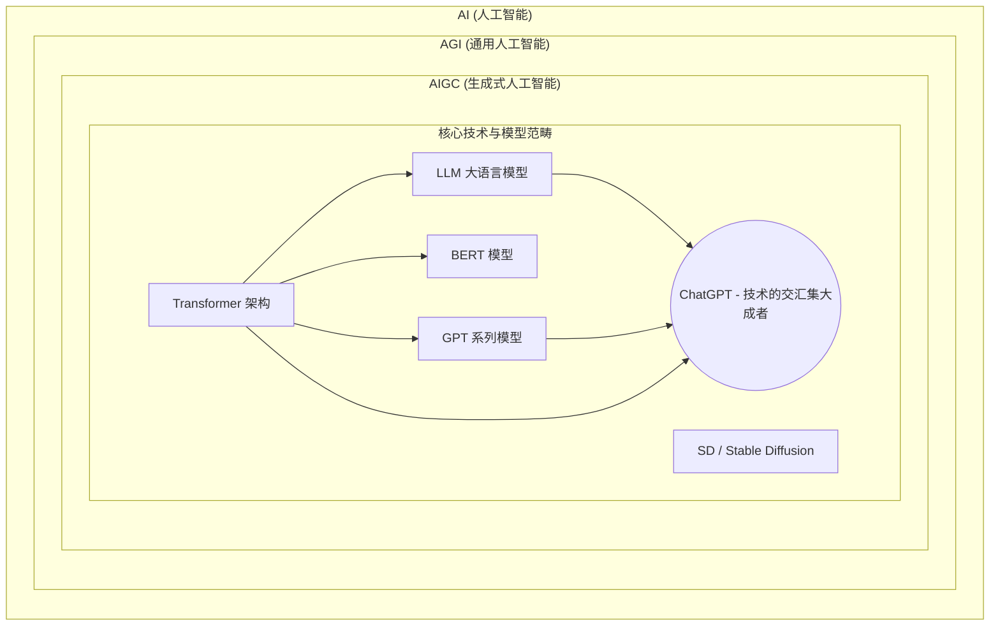

# 7 自然语言处理

## [MoE：聊一聊 LLM 参数量、计算量和 MFU 等](https://www.51cto.com/aigc/2965.html)

## [LLM的参数量和计算量](https://blog.csdn.net/wxc971231/article/details/135434478)

图片展示的是 AI / AGI / AIGC 及其底层技术（Transformer、BERT、GPT、LLM 等）之间的层级与包含关系。

图片的核心逻辑是：

外层包含关系：AI (人工智能) 包含 AGI (通用人工智能) 包含 AIGC (生成式人工智能)。

内层技术/模型关系：在 AIGC 的范畴内，包含各种架构与模型（如 Transformer、BERT、GPT、LLM、SD 等），且它们之间存在交叉（例如 ChatGPT 恰好位于 Transformer、BERT/GPT、LLM 等技术交集的中心红点位置）。

